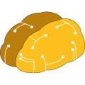

# Cloud4.ai Node.js SDK

| LTS | Latest | npm               |
|---------------|----------|---------------------------|
| v1.0.0      |   v1.0.1    |     [@c4ai/node-sdk](https://npm.com)    |


<!-- TABLE OF CONTENTS -->
## Table of Contents

- [About the Project](#overview)
- [Quick Start](#quick-start)
- [Examples](#examples)
  - [Raw](#simple-raw)
  - [OOP](#oop-example)
- [Services](#services)
  - [AAC](#aac)
  - [KDB](#kdb)
  - [EES](#ees)
  - [Prompt Library](#PL-PLPrompt)
- [ENV Variables](#Environment-variables)
- [Contact](#contact)


## Overview
The Cloud4.ai Node.js SDK is a powerful library that enables developers to interact seamlessly with the cloud4.ai platform. This SDK provides a set of utilities and functions to integrate your Node.js applications with [cloud4.ai](https://cloud4.ai), allowing you to leverage advanced AI capabilities effortlessly.
<br/>
Working with Cloud4.ai you can use a set of managed services that can be configured via [C4AI Cloud Console](https://console.cloud4.ai), or through SDK. Combining these building blocks it is possible to build many different AI applications effortlessly switching between AI providers, Databases and other services to improve your application workflows.

## Quick Start

#### Step 1: Install SDK

```bash

cd /your/project

npm i @c4ai/sdk-node

```

#### Step 2: Provide Credentials 

You can pass credentials through ENV variable or via code:

##### BASH 

```bash
# Mandatory
C4AI_CLIENT_ID=C4AI--client::769e6cb6597b...YOUR_ID...911f3060c161
C4AI_CLIENT_SECRET=C4AI--secret::5ca6204b...YOUR_SECRET...e90c00a263f4db

```

##### In APPLICATION 

```javascript
const C4AI_CLIENT_ID = process.env.C4AI_CLIENT_ID!;
const C4AI_CLIENT_SECRET = process.env.C4AI_CLIENT_SECRET!
C4AI_SDK_Context.setCredentials(
    C4AI_CLIENT_ID,
    C4AI_CLIENT_SECRET

await C4AI_SDK_Context.authenticate();
```


#### Step 4: Start Using  
```javascript
const eesSic = 'sic@0000000000:ees:0000000000';
const aacSic = 'sic@0000000000:aac-instance:0000000000';

const command = new C4AI_EES.Commands.EXECUTE({
    // to simulate empty service
    service: new C4AI_EES(eesSic),
    command: new C4AI_AAC.Commands.EXECUTE({
        service: new C4AI_AAC(aacSic),
        parameters: new C4AI_RequestParameters(
            new C4AI_RequestParameter('prompt', 'Say Hello!'),
        ),
    }),
    options: new C4AI_EES_ExecutionOptions({
        priority: C4AI_SDK_TYPES__EES_ExecutionPriority.INSTANT,
        retries:3,
        deduplicationId:`combination_of_unique_parameters`,
        callback: [
            new C4AI_AAC.Commands.EXECUTE({
                service: new C4AI_AAC(aacSic),
                parameters: new C4AI_RequestParameters(
                    new C4AI_RequestParameter('prompt', 'Say Hello!'),
                ),
            }),
        ],
        fallback: [
            new C4AI_AAC.Commands.EXECUTE({
                service: new C4AI_AAC(aacSic),
                parameters: new C4AI_RequestParameters(
                    new C4AI_RequestParameter('prompt', 'Say Hello!'),
                ),
            })
        ]
    }),
});

const result = await command.execute()
```


### Examples

> Find more examples in [Examples Folder](./examples)

### Simple Raw 


```javascript
// Import necessary modules
import { C4AI, EES } from '../src';

const c4ai = new C4AI({
    // You can find your credentials here: https://console.cloud4.ai/api/credentials
    key: 'C4AI_API_KEY',
});


const resp = await new EES({
    sic: '@yourorg/elastic-endpoint-sync'
})
    .executeRaw({
        mode: 'play',
        aac: {
            // your AI API Executor ID from C4AI Cloud Console
            sic: '@yourorg/openai-gpt'
        },
        parameters: {
            // actual remote params comes from AAC Definition
            // You can check a set of parameters in playground or in AAC overview
            foo: 'bar',
            model: 'gpt4'
        },
        credentials: {
            // Credentials for AAC.  
            // You can check a set of credentials in playground or in AAC overview
            OPEN_AI_KEY: "YOUR_API_KEY"
        },
        _bindings: {
            prompt: {
                // Desired Prompt Identity from C4AI Cloud Console
                sic: '@yourorg/prompt-you-wish',
                params: {
                    // Parameters you created in Prompt Service
                    prompt_param_1: 'param1',
                    prompt_param_2: 'param2'
                }
            },
        }
    });

```

### OOP Example

```javascript
// Import necessary modules
import { C4AI, AAC, EES, PLPrompt, CSS } from '../src';


const c4ai = new C4AI({
    // You can find your credentials here: https://console.cloud4.ai/api/credentials
    key: 'C4AI_API_KEY',
});


// You can define your own types for the credentials to simplify synchronization
interface ICustomAACModelCredentials {
    MODEL_KEY: string
}


// Your credentials
const targetCSS = new CSS<ICustomAACModelCredentials>({
    sic: '@yourorg/openai-credentials'
});

// Input Prompt
const positivePrompt = new PLPrompt({
    sic: '@yourorg/advertisement-prompt'
})

// Input API Connector Instance 
const targetAAC = new AAC({
    sic: '@yourorg/openai-gpt'
})

// Elastic Endpoint 
const targetEES = new EES({
    sic: '@yourorg/elastic-endpoint-sync'
});


const resp = await targetEES
    .execute({
        aac: targetAAC,
        css: targetCSS,
    }, {
        foo: 'bar',
        prompt: positivePrompt,
    });

```


## Services

<!-- ============AAC SERVICE=========== -->


###  AAC 
AI API Connector Service ([AAC](https://cloud4.ai/services/aac.html)) &mdash; allows integrate with any AI tool using friendly interface or using pre-made templates. Provides many options of the ways to consume response data. 


> If you're looking for the specific Integration &mdash; you can request it via Cloud Console or create a custom AAC by yourself.


<!-- ============AIL SERVICE=========== -->



###  AIL 
AI Lambda Service ([AIL](https://cloud4.ai/services/ail.html)) &mdash; allows you to use open source models for the specific tasks without own hosting and Pay as you go strategy. You can leverage the most popular AI models from [Hugging Face](https://huggingface.co/) simply providing a target model in your request.


> If you're looking for the specific Model &mdash; you can request it via Cloud Console


<!-- ============KDB SERVICE=========== -->


###  KDB
KnowledgeBase Service ([KDB](https://cloud4.ai/services/kdb.html))  &mdash; is a service that allows you to create your own attachable storage for many integrations using RAG technique. 

- **Individual Parsing Strategy with AIL/AAC:** You can define different models for each filetype or specific file to improve data quality.
- **Unlimited DBs Number:** You can create an individual DB for each your customer or product to use it in specific cases. 
- **Multiple Attach:** You can attach multiple KDBs to each request (*depending on model limits*) to get more accurate responses. 
- **Semantic Search:** You can search across your data empower your engine with AI. 
 


<!-- ============EES SERVICE=========== -->

###  EES 
Elastic Endpoint Service ([EES](https://cloud4.ai/services/ees.html)) &mdash; is a unified entrypoint that helps to manage integration between AI providers and your application. Using this service its possible to empower your solution with the following features:
- **Integration Type:** Sync/Async You can define how do you prefer receive responses: using webhooks, stream or sync HTTP request.
- **Retry Strategy:** You can define retry behaviors, and corner scenarios.  
- **Fallback Model:** it is possible to define default fallback model to prevent unsuccessful generations. 
- **RBAC:** Role based access using API and more.


<!-- ============PL SERVICE=========== -->


###  PL-PLPrompt
Prompt Library Service ([PL](https://cloud4.ai/services/pl.html)) &mdash; allows effortlessly manage prompts for different AI providers using Roles Based Access (RBAC), parameters and usage tracking.


###  CSS 
Credentials Store Service ([CSS](https://cloud4.ai/services/css.html))  &mdash;  allows securely manage credentials for many different AI providers and empower your solution with features like: 
- **Auto Switch:** You can select or create your won strategy for "credentials switching". Round-robin, Date/Hour/Minute based options available from scratch. 
- **Expiration:** Allows you define auto expiration for CSS Credential Records.
- **RBAC:** Role based access both Cloud Console and API.


## Usage Scenarios


## Examples

**For Mode Examples Please open [Examples Folder]('./examples') ** 


## Environment Variables

| Variable Name | Required | Description               |
|---------------|----------|---------------------------|
| C4AI_KEY      |    NO    |      Your cloud4.ai API Key. Is not mandatory because it is possible to provide *C4AI_KEY*  through the code    |
| API_SECRET    |    NO    | Your cloud4.ai API Secret |


## Links

- [cloud4.ai Website](https://www.cloud4.ai)
- [Documentation](https://docs.cloud4.ai)
- [Report Issues](https://github.com/yourusername/c4ai-node/issues)
- [ADAAS Website](https://www.adaas.org)

---


[Cloud4.ai Logo]: ./docs/logo.png
[Developer Logo]: developer_logo.png
